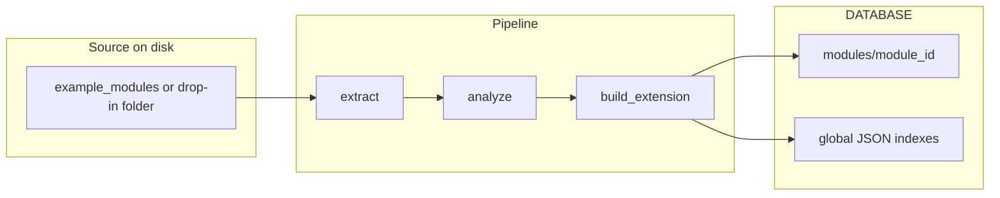

# Filesystem design

This document describes the **file-based “database”** and **module filesystem** for this project. It is not a relational database; persistence is JSON and other artifacts on disk so the layout stays **transparent**, **inspectable**, and easy to monitor (for example with a filesystem watcher).

---

## Top-level layout

```
New folder (3)/
├── DATABASE/           # Runtime registry (ingested modules, global indexes)
├── ENVIRONMENTS/       # Reusable runtime environment definitions
├── example_modules/    # Source modules before ingestion (templates / examples)
├── core/               # Application logic (orchestration, database manager, etc.)
├── gui/                # Desktop UI
├── main.py
├── requirements.txt
└── …
```

Application code under `core/` and `gui/` is documented only where it defines or updates paths under `DATABASE/` or `ENVIRONMENTS/`.

---

## `DATABASE/` — canonical reference

Root constant in code: `DATABASE` (see `core/database_manager.py`).

| Area | Path | Role |
|------|------|------|
| Master index | `DATABASE/index.json` | Maps each `module_id` to display name, version, purpose, `stored_at`, and `module_dir`. |
| Per-module folder | `DATABASE/modules/{module_id}/` | Isolated store for one ingested extension. |
| Package blob | `DATABASE/modules/{module_id}/extension.pkg` | Full extension package (JSON) produced by the pipeline. |
| Capabilities (copy) | `DATABASE/modules/{module_id}/capabilities.json` | Capability registry entry for this module. |
| Routing (copy) | `DATABASE/modules/{module_id}/routing.json` | Routing definition for this module. |
| State | `DATABASE/modules/{module_id}/state.json` | Lifecycle / stage metadata (e.g. after store). |
| Analyzer summary | `DATABASE/modules/{module_id}/analyzer_output.json` | Analyzer output snapshot for this module. |
| Global capabilities | `DATABASE/capabilities/global_registry.json` | All modules’ capability entries keyed by `module_id`. |
| Global routes | `DATABASE/routes/routing_table.json` | All modules’ routing definitions keyed by `module_id`. |
| Synergy routing hints | `DATABASE/routes/synergy_routes.json` | Optional file: populated when the orchestration engine records synergy-based routing hints (see `core/orchestration_engine.py`, `_configure_routes`). May be absent if no synergies have been written yet. |
| Environment map | `DATABASE/environments/environment_map.json` | Maps each `module_id` to a recommended environment name (e.g. `cpu_env`). |

### Concurrency

Shared JSON files under `DATABASE/` are updated with **per-file locks** and **read–modify–write** helpers so concurrent updates are less likely to corrupt files (`_get_lock`, `_update_json` in `core/database_manager.py`).

### Store and remove (behavioral summary)

- **`store_module(module_id, package)`** creates `DATABASE/modules/{module_id}/`, writes the per-module files above, then merges into `global_registry.json`, `routing_table.json`, `environment_map.json`, and `index.json`.
- **`remove_module(module_id)`** deletes the module folder and removes that `module_id` from the four aggregate JSON files, then purges related in-memory state and notifies listeners (see `remove_module` docstring in `core/database_manager.py`).
- **`update_module_capabilities(module_id, new_capabilities)`** refreshes per-module and global capability data and propagates to intent / expansion / UI adaptation paths.
- **Kafka consumer** `handle_pipeline_message` skips storing if `DATABASE/modules/{module_id}/state.json` already exists (duplicate guard).

---

## Lifecycle (data flow)

A **source module** on disk is extracted and analyzed; **`build_extension`** in `core/extension_builder.py` builds one standardized **package** dictionary. **`store_module`** in `core/database_manager.py` persists that package into the per-module directory and the global registry files.



---

## Example source module layout (`example_modules/nlp_processor/`)

These files are **authoring / template** layout before ingestion. After ingestion, the system also maintains normalized copies under `DATABASE/modules/{module_id}/` (and aggregates).

| Path | Typical role |
|------|----------------|
| `module_manifest.json` | Name, id, version, entry points, runtime type, compatibility. |
| `module_metadata.json` | Description, tags, author, system id, timestamps. |
| `module_config.yaml` | Module-level configuration. |
| `capabilities.json` | Declared actions / capabilities. |
| `intents.json` | Intent definitions used by routing / NLP-style flows. |
| `routes.json` | Route declarations. |
| `dependencies.json` | Dependency metadata. |
| `requirements.txt` | Python dependencies for the module. |
| `runtime.env` | Runtime environment hints. |
| `src/` | Implementation (`main.py`, `handler.py`, `router.py`, `executor.py`, etc.). |
| `assets/configs/`, `assets/schemas/`, `assets/prompts/` | Config, JSON schema, prompts. |
| `templates/` | `.template` files (e.g. routing, runtime, communication). |
| `environments/*.env` | Env-specific snippets. |
| `cache/`, `logs/`, `exports/` | Local cache, logs, export area. |

**Mental model:** edit and version control under `example_modules/`; the runtime **source of truth** for what the host has loaded is under `DATABASE/`.

---

## `ENVIRONMENTS/`

Reusable environment **definitions** (not the per-module map in `DATABASE`).

- **`ENVIRONMENTS/index.json`** — catalog of environment keys (e.g. `cpu_env`, `gpu_env`, `torch_env`, `fastapi_env`) with display names, hardware hints, and package lists.
- **Per-environment folder** (e.g. `ENVIRONMENTS/cpu_env/`) — typically includes:
  - `env_meta.json`
  - `requirements.txt`
  - `activate.sh`

The **`DATABASE/environments/environment_map.json`** file links each **ingested `module_id`** to one of these environment names.

---

## Appendix: rating and review

Use this section for self-review or external reviewers. **No scores are prefilled.**

### Criteria (what to judge)

1. **Separation of concerns** — Is the split between source modules (`example_modules/`), runtime registry (`DATABASE/`), and environment definitions (`ENVIRONMENTS/`) clear and consistent?
2. **ID consistency** — Are `module_id` keys used uniformly across `index.json`, `modules/{id}/`, and aggregate files?
3. **Discoverability** — Can a new developer find capabilities, routing, and env binding without reading all of `core/`?
4. **Concurrency and integrity** — Is the per-file lock + merge pattern adequate for expected workloads? What happens if someone edits JSON by hand while the app runs?
5. **Operational ergonomics** — Backup, diff, reset: is a file-based layout a net win for your deployment?
6. **Optional / derived artifacts** — Is it obvious that `synergy_routes.json` is derived and may be missing until synergies are configured?

### Rubric (1–5, optional)

| Criterion | 1 | 2 | 3 | 4 | 5 | Notes |
|-----------|---|---|---|---|---|-------|
| Clarity of layout | | | | | | |
| Consistency of naming / IDs | | | | | | |
| Documentation adequacy | | | | | | |
| Safety under concurrency / manual edits | | | | | | |
| Fit for operations (backup, audit, tooling) | | | | | | |

**Reviewer / date:** _______________________

**Overall comments:** _______________________
