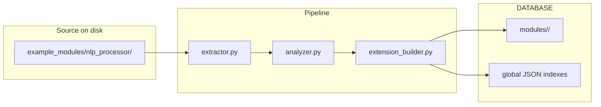

<a id="top"></a>

<!-- ═══════════════════════  HERO BANNER  ═══════════════════════ -->
<p align="center">
  
</p>

<p align="center">
  <a href="https://python.org"></a>
  <a href="https://www.riverbankcomputing.com"></a>
  <a href="https://pytorch.org"></a>
  <a href="https://sqlite.org"></a>
  <a href="LICENSE"></a>
  
</p>

<p align="center">
  
</p>

<p align="center">
  
  
  
</p>

<p align="center">
  <a href="https://github.com/SAMRADDHASHRIVASTAVATECH">
    
  </a>
</p>

<p align="center">
  <b>Built, engineered, and maintained exclusively by:</b> <code>SAMRADDHASHRIVASTAVATECH</code>
</p>

> [!IMPORTANT]
> **Mission Statement:** SILEXIS is an enterprise-grade pipeline for extracting, structuring, and orchestrating complex runtime data into high-quality ML-ready datasets. It is designed as a transparent, file-backed system with isolated execution environments, live registry updates, and a modular GUI for full operational visibility.

<p align="center"></p>

## Table of Contents

| # | Section |
|---|---------|
| 1 | [Project Overview](#project-overview) |
| 2 | [Architecture](#architecture) |
| 3 | [System Previews](#system-previews) |
| 4 | [Repository Structure](#repository-structure) |
| 5 | [Core Modules](#core-modules) |
| 6 | [Setup Guide](#setup-guide) |
| 7 | [Data Flow](#data-flow) |
| 8 | [Filesystem Contract](#filesystem-contract) |
| 9 | [Future Scope](#future-scope) |

---

<a id="project-overview"></a>
## Project Overview

SILEXIS is a modular orchestration platform for transforming raw source modules into runtime-ready packages, tracking them through a canonical file-backed registry, and routing them into the most appropriate execution environment.

### Key Capabilities

| Capability | Detail |
|---|---|
| File-backed registry | All module state is stored in inspectable JSON and package artifacts under `DATABASE/`. |
| Event-driven ingestion | New modules are extracted, analyzed, and packaged through the ingestion pipeline. |
| Isolated environments | Modules can be routed to dedicated runtime environments such as `cpu_env`, `gpu_env`, `fastapi_env`, and `torch_env`. |
| Intent and capability routing | Built-in registries support capability lookup and intelligent orchestration. |
| Live GUI monitoring | The desktop interface exposes ecosystem state, watchdog activity, and module details in real time. |
| Concurrency safety | Per-file locking and read-modify-write behavior help protect registry integrity. |

<p align="right"><a href="#top">⬆️ Back to Top</a></p>

---

<a id="architecture"></a>
## Architecture



Every stage is decoupled and communicates through clear file contracts, which keeps the system testable, inspectable, and easy to extend.

### Runtime Flow

1. A source module is dropped into the system.
2. The extractor scans the module folder.
3. The analyzer classifies capabilities, intents, and routing hints.
4. The builder creates a normalized package.
5. The database manager writes the package into `DATABASE/` and updates the global registries.
6. The GUI refreshes to reflect the new state.

<p align="right"><a href="#top">⬆️ Back to Top</a></p>

---

<a id="system-previews"></a>
## System Previews

### Voidwalker Terminal Hub

A command-focused control surface for orchestration, monitoring, and runtime inspection.

### Adaptive Dashboard

A live module-aware interface for observing current registry state, routing status, and execution environment mappings.

<p align="right"><a href="#top">⬆️ Back to Top</a></p>

---

<a id="repository-structure"></a>
## Repository Structure

```text
SILEXIS/
├── core/
│   ├── orchestration_engine.py
│   ├── kafka_pipeline.py
│   ├── database_manager.py
│   ├── environment_manager.py
│   ├── ui_adaptation_engine.py
│   └── ...
├── DATABASE/
│   ├── index.json
│   ├── capabilities/
│   ├── routes/
│   ├── environments/
│   └── modules/
├── ENVIRONMENTS/
│   ├── index.json
│   ├── cpu_env/
│   ├── fastapi_env/
│   ├── gpu_env/
│   └── torch_env/
├── example_modules/
│   └── nlp_processor/
├── gui/
│   ├── main_window.py
│   └── panels/
├── main.py
├── docker-compose.yml
├── requirements.txt
├── FILESYSTEM_DESIGN.md
└── test_*.py
```

### Example Module Layout

```text
example_modules/nlp_processor/
├── assets/
├── cache/
├── environments/
├── exports/
├── logs/
├── src/
├── templates/
├── capabilities.json
├── dependencies.json
├── intents.json
├── module_config.yaml
├── module_manifest.json
├── module_metadata.json
├── requirements.txt
├── routes.json
└── runtime.env
```

<p align="right"><a href="#top">⬆️ Back to Top</a></p>

---

<a id="core-modules"></a>
## Core Modules

### `core/orchestration_engine.py`
Coordinates module lifecycle, registry updates, and routing decisions.

### `core/kafka_pipeline.py`
Handles event-driven ingestion and module handoff through the pipeline.

### `core/database_manager.py`
Maintains the canonical `DATABASE/` state, including per-module stores and global indexes.

### `core/environment_manager.py`
Maps modules to execution environments and maintains reusable environment definitions.

### `core/ui_adaptation_engine.py`
Keeps the interface synchronized with the loaded module ecosystem.

<p align="right"><a href="#top">⬆️ Back to Top</a></p>

---

<a id="setup-guide"></a>
## Setup Guide

### Prerequisites

- Python 3.10 or newer
- Docker Desktop
- Windows 10 or Windows 11

### Installation

```powershell
python -m venv venv
venv\Scripts\activate
pip install -r requirements.txt
```

### Run the System

```powershell
docker-compose up -d
python main.py
```

### Run the Tests

```powershell
pytest test_orchestration.py test_pipeline.py test_ui_adaptation.py
```

### Ingesting Modules

Drag and drop a source module folder, such as `example_modules\nlp_processor\`, into the GUI drop area. The ingestion pipeline will analyze it, normalize it, and write the resulting package into `DATABASE/`.

<p align="right"><a href="#top">⬆️ Back to Top</a></p>

---

<a id="data-flow"></a>
## Data Flow

The source of truth for loaded runtime modules lives in `DATABASE/`. The authoring source remains in `example_modules/`, while environment definitions live in `ENVIRONMENTS/`.

### Canonical Registry Paths

| Area | Path | Role |
|---|---|---|
| Master index | `DATABASE/index.json` | Maps each `module_id` to display name, version, purpose, and storage path. |
| Per-module folder | `DATABASE/modules/{module_id}/` | Isolated store for one ingested extension. |
| Package blob | `DATABASE/modules/{module_id}/extension.pkg` | Normalized extension package produced by the pipeline. |
| Capabilities copy | `DATABASE/modules/{module_id}/capabilities.json` | Module-specific capability registry. |
| Routing copy | `DATABASE/modules/{module_id}/routing.json` | Module-specific routing definition. |
| State | `DATABASE/modules/{module_id}/state.json` | Lifecycle and ingestion metadata. |
| Analyzer output | `DATABASE/modules/{module_id}/analyzer_output.json` | Analyzer snapshot for the module. |
| Global capabilities | `DATABASE/capabilities/global_registry.json` | Capability index across all modules. |
| Global routes | `DATABASE/routes/routing_table.json` | Routing index across all modules. |
| Synergy hints | `DATABASE/routes/synergy_routes.json` | Optional routing hints recorded by orchestration. |
| Environment map | `DATABASE/environments/environment_map.json` | Maps each module to an execution environment. |

### Concurrency Model

Shared JSON files are updated with per-file locks and read-modify-write helpers to reduce the risk of corruption during rapid ingestion.

<p align="right"><a href="#top">⬆️ Back to Top</a></p>

---

<a id="filesystem-contract"></a>
## Filesystem Contract

SILEXIS is designed around an explicit filesystem contract. The layout is intentionally transparent so every registry file, module artifact, and environment mapping can be inspected directly without relying on hidden state.

### Principles

- `example_modules/` is the authoring layer.
- `DATABASE/` is the runtime truth.
- `ENVIRONMENTS/` defines reusable execution profiles.
- Every ingestion step produces durable artifacts.
- GUI state should always reflect the current file state.

<p align="right"><a href="#top">⬆️ Back to Top</a></p>

---

<a id="future-scope"></a>
## Future Scope

- Expanded module-level telemetry
- More environment presets
- Richer live graphing in the GUI
- Automated package validation before ingestion
- Enhanced routing heuristics for complex intent chains

<p align="right"><a href="#top">⬆️ Back to Top</a></p>
